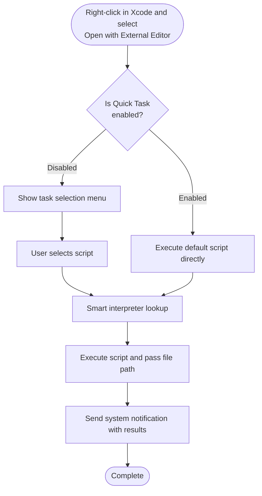

# Script Execution Engine

At the core of <!--@include: @/.vitepress/snippets/app-name.md--> is a powerful script execution engine that supports multiple scripting languages.

## Execution Flow

When you right-click and select "Open with External Editor" in Xcode, <!--@include: @/.vitepress/snippets/app-name.md--> executes scripts following this workflow:



## Supported Scripting Languages

Thanks to its powerful interpreter functionality, <!--@include: @/.vitepress/snippets/app-name.md--> theoretically supports all scripting languages!

## Smart Interpreter Matching

<!--@include: @/.vitepress/snippets/app-name.md--> uses a two-tier strategy to match the appropriate interpreter:

### Priority 1: Shebang Recognition

<!--@include: @/.vitepress/snippets/app-name.md--> first reads the script's first line to look for a shebang (`#!`):

```bash
#!/bin/bash
# Execute with /bin/bash
```

```python
#!/usr/bin/env python3
# Execute with python3 from environment variables
```

```ruby
#!/usr/bin/ruby
# Execute with /usr/bin/ruby
```

::: tip Best Practice
We recommend using the `#!/usr/bin/env <interpreter>` format, which automatically uses the interpreter from PATH for better portability.
:::

### Priority 2: File Extension Matching

If the script doesn't have a shebang, <!--@include: @/.vitepress/snippets/app-name.md--> intelligently matches based on file extension:

- `.sh` → bash / zsh
- `.py` → python3 / python
- `.rb` → ruby
- `.swift` → swift
- `.pl` → perl
- `.lua` → lua
- `.php` → php
- `.go` → go
- `.js` / `.ts` → node

## File Path Passing

When a script is executed, <!--@include: @/.vitepress/snippets/app-name.md--> passes the file's absolute path as the first argument:

```bash
#!/bin/bash
# $1 = absolute path of the file
echo "Processing file: $1"
```

```python
#!/usr/bin/env python3
# sys.argv[1] = absolute path of the file
import sys
print(f"Processing file: {sys.argv[1]}")
```

```ruby
#!/usr/bin/env ruby
# ARGV[0] = absolute path of the file
puts "Processing file: #{ARGV[0]}"
```

## Interpreter Configuration

<!--@include: @/.vitepress/snippets/app-name.md--> needs to know how to execute different types of scripts. The interpreter configuration feature lets you manage these settings.

### View Interpreter List

1. Open Settings (`Command + ,`)
2. Switch to the "Interpreters" tab
3. View all currently configured interpreters

### Auto-Detect Interpreters

<!--@include: @/.vitepress/snippets/app-name.md--> can automatically scan your system for interpreters:

1. In the "Interpreters" tab
2. Click the "Auto-detect System Interpreters" button
3. <!--@include: @/.vitepress/snippets/app-name.md--> will scan common paths

**Common interpreter paths**:
- **Bash** - `/bin/bash`, `/usr/local/bin/bash`
- **Zsh** - `/bin/zsh`, `/usr/local/bin/zsh`
- **Python** - `/usr/bin/python3`, `/usr/local/bin/python3`, `/opt/homebrew/bin/python3`
- **Ruby** - `/usr/bin/ruby`, `/usr/local/bin/ruby`
- **Swift** - `/usr/bin/swift`

### Manually Add Interpreter

If auto-detection doesn't find the interpreter you need, you can add it manually:

1. Click the "Add" button in the interpreter list
2. Enter the complete path to the interpreter
3. <!--@include: @/.vitepress/snippets/app-name.md--> will verify if the interpreter is available

### Remove Interpreter

1. Select the interpreter to remove from the list
2. Click the "Remove" button
3. Confirm the removal

::: info Don't Worry, It Won't Actually Delete
This operation only removes the interpreter from the list. It won't delete the file from your computer.
:::

### Adjust Interpreter Priority

If you have multiple versions of an interpreter installed (such as Python 2 and Python 3), you can adjust their priority using the up/down buttons. **Interpreters at the top have higher priority**.

### Configure Search Paths

You can customize the interpreter search paths:

1. In the "Interpreters" tab, find the "Search Paths" section
2. Add custom paths (such as `/opt/local/bin`)
3. <!--@include: @/.vitepress/snippets/app-name.md--> will search for interpreters in these paths

The "Auto-search Interpreters" list in the "Interpreters" tab displays the interpreter types that will be searched during automatic detection. Interpreters not in this list won't be automatically added to the interpreter list.
