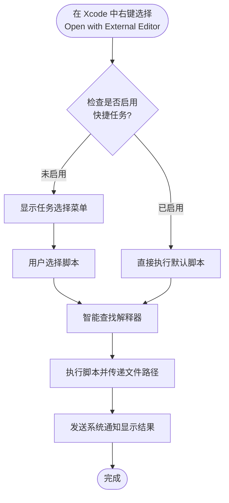

# 脚本执行引擎

<!--@include: @/.vitepress/snippets/app-name.md--> 的核心是一个强大的脚本执行引擎，支持多种脚本语言。

## 执行流程

当你在 Xcode 中右键选择「Open with External Editor」时，<!--@include: @/.vitepress/snippets/app-name.md--> 会按照以下流程执行脚本：



## 支持的脚本语言

<!--@include: @/.vitepress/snippets/app-name.md--> 凭借强大的解释器功能，理论上支持所有脚本语言！

## 智能解释器匹配

<!--@include: @/.vitepress/snippets/app-name.md--> 使用两级策略来匹配合适的解释器：

### 优先级 1：Shebang 识别

<!--@include: @/.vitepress/snippets/app-name.md--> 会首先读取脚本的第一行，查找 shebang（`#!`）：

```bash
#!/bin/bash
# 使用 /bin/bash 执行
```

```python
#!/usr/bin/env python3
# 使用环境变量中的 python3 执行
```

```ruby
#!/usr/bin/ruby
# 使用 /usr/bin/ruby 执行
```

::: tip 最佳实践
推荐使用 `#!/usr/bin/env <interpreter>` 格式，这样可以自动使用 PATH 中的解释器，更具可移植性。
:::

### 优先级 2：文件扩展名匹配

如果脚本没有 shebang，<!--@include: @/.vitepress/snippets/app-name.md--> 会根据文件扩展名智能匹配：

- `.sh` → bash / zsh
- `.py` → python3 / python
- `.rb` → ruby
- `.swift` → swift
- `.pl` → perl
- `.lua` → lua
- `.php` → php
- `.go` → go
- `.js` / `.ts` → node

## 文件路径传递

当脚本被执行时，<!--@include: @/.vitepress/snippets/app-name.md--> 会将文件的绝对路径作为第一个参数传递给脚本：

```bash
#!/bin/bash
# $1 = 文件的绝对路径
echo "处理文件：$1"
```

```python
#!/usr/bin/env python3
# sys.argv[1] = 文件的绝对路径
import sys
print(f"处理文件：{sys.argv[1]}")
```

```ruby
#!/usr/bin/env ruby
# ARGV[0] = 文件的绝对路径
puts "处理文件：#{ARGV[0]}"
```

## 解释器配置

<!--@include: @/.vitepress/snippets/app-name.md--> 需要知道如何执行不同类型的脚本，解释器配置功能让你可以管理这些设置。

### 查看解释器列表

1. 打开设置窗口（`Command + ,`）
2. 切换到「解释器」标签页
3. 查看当前配置的所有解释器

### 自动检测解释器

<!--@include: @/.vitepress/snippets/app-name.md--> 可以自动扫描系统中的解释器：

1. 在「解释器」标签页中
2. 点击「自动检测系统解释器」按钮
3. <!--@include: @/.vitepress/snippets/app-name.md--> 会扫描常见路径

**常见的解释器路径**：
- **Bash** - `/bin/bash`, `/usr/local/bin/bash`
- **Zsh** - `/bin/zsh`, `/usr/local/bin/zsh`
- **Python** - `/usr/bin/python3`, `/usr/local/bin/python3`, `/opt/homebrew/bin/python3`
- **Ruby** - `/usr/bin/ruby`, `/usr/local/bin/ruby`
- **Swift** - `/usr/bin/swift`

### 手动添加解释器

如果自动检测没有找到你需要的解释器，可以手动添加：

1. 在解释器列表中点击「添加」按钮
2. 输入解释器的完整路径
3. <!--@include: @/.vitepress/snippets/app-name.md--> 会验证解释器是否可用

### 删除解释器

1. 在解释器列表中选择要删除的解释器
2. 点击「删除」按钮
3. 确认删除操作

::: info 放心，不会真的删除
该删除操作只是将解释器从列表中删除，不会将该文件从您的电脑上删除
:::

### 调整解释器优先级

如果系统中安装了多个版本的解释器（如 Python 2 和 Python 3），您可以通过上下移动按钮调整优先级，**排在前面的解释器优先级更高**。

### 配置搜索路径

你可以自定义解释器的搜索路径：

1. 在「解释器」标签页中找到「搜索路径」部分
2. 添加自定义路径（如 `/opt/local/bin`）
3. <!--@include: @/.vitepress/snippets/app-name.md--> 会在这些路径中查找解释器

在「解释器」标签页的「自动搜索解释器」列表中，展示了自动搜索时会寻找的解释器类型。不在这个列表中的解释器将不会被自动添加到解释器列表中。
